# Template Submission Proposal Tugas Akhir

> Ikuti panduan detail pada [materials/Minggu-11.pdf](materials/Minggu-11.pdf) dan [materials/Minggu-12.pdf](materials/Minggu-12.pdf) sebelum mengisi setiap bagian. Hapus seluruh teks instruksi setelah Anda menggantikannya dengan isi final.

---

- **Nama:** Muhammad Irfan Maulana
- **NIM:** 202310370311480

## 1. Topik Penelitian

### 1.1 Topik Penelitian
*Tuliskan judul singkat topik penelitian Anda. Anda dapat memakai topik dari tugas UTS sebelumnya atau merumuskan topik baru. Pastikan spesifik hingga level leaf pada tree topik.*

### 1.2 Tujuan Umum (Aim)
*Uraikan satu kalimat yang menggambarkan tujuan strategis utama penelitian. Rujuk konsep Aim pada Minggu-11, slide 5-9, untuk struktur kalimat yang tepat.*

### 1.3 Tujuan Khusus (Objectives)
*Buat daftar 3–5 tujuan operasional. Gunakan format bullet. Pastikan setiap tujuan memenuhi kriteria SMART (Specific, Measurable, Achievable, Relevant, Time-bound) seperti dicontohkan di slide Minggu-11, slide 5-9.*

---

## 2. Perencanaan Pengerjaan Proyek

### 2.1 Work Breakdown Structure (WBS)
```
Ganti blok ini dengan tree WBS Anda. Minimal empat level sesuai contoh Minggu-11, slide 11-12.
Pastikan setiap node level terendah mewakili leaf task yang bisa diestimasi.
```

### 2.2 Estimasi Waktu Leaf Task
| ID | Leaf Task (activity) | Effort (minggu) | Durasi (minggu) | Ketergantungan |
|----|-----------|--------------------|------------------------|----------------|
| ... | ... | ... | ... | ... |

*Isi tabel dengan seluruh leaf task dari WBS. Gunakan effort dan durasi realistis (lihat metode estimasi di Minggu-11, slide 14). Cantumkan dependensi antar task menggunakan ID.*

### 2.3 Critical Path
*Tuliskan urutan task yang membentuk critical path beserta total durasinya. Sertakan justifikasi singkat sesuai langkah perhitungan di slide Minggu-11, slide 18-25.*

### 2.4 Milestone
- *M1: ...*
- *M2: ...*
- *... Tambahkan milestone lainnya jika diperlukan, rujuk slide Minggu-11, slide 16, 24, 25.*

### 2.5 Activity-on-Node (AON) Diagram
*Buat diagram AON mengikuti Minggu-11, slide 26-37, atau alternatif Gantt Chart seperti Minggu-12, slide 3-4 (pilih salah satu). Pastikan diagram menampilkan dependensi kritis dan konsisten dengan tabel estimasi. Tips: render di VS Code memakai ekstensi `Markdown Preview Mermaid Support`, atau lampirkan gambar jika Mermaid tidak dapat digunakan. Diagram Mermaid akan tampil otomatis di GitHub.*

### 2.5 Activity-on-Node (AON) Diagram

*AON*

```mermaid
graph LR
  %% Definisi Node dengan informasi Start & Durasi (minggu)
  T1["<b>T1: Pencarian Jurnal</b><br/>Start: Minggu 1<br/>Durasi: 1 minggu"]
  T2["<b>T2: Seleksi Artikel</b><br/>Start: Minggu 2<br/>Durasi: 1 minggu"]
  T3["<b>T3: Penulisan Ringkasan Literatur</b><br/>Start: Minggu 3<br/>Durasi: 2 minggu"]
  M1{{Milestone 1: Studi Literatur Selesai}}

  T4["<b>T4: Pengumpulan Dataset</b><br/>Start: Minggu 5<br/>Durasi: 1 minggu"]
  T5["<b>T5: Preprocessing Data</b><br/>Start: Minggu 6<br/>Durasi: 2 minggu"]
  M2{{Milestone 2: Data Siap Digunakan}}

  T6["<b>T6: Implementasi Model</b><br/>Start: Minggu 8<br/>Durasi: 3 minggu"]
  T7["<b>T7: Training & Tuning Model</b><br/>Start: Minggu 11<br/>Durasi: 2 minggu"]
  M3{{Milestone 3: Model Siap Diuji}}

  T8["<b>T8: Pengujian Model</b><br/>Start: Minggu 13<br/>Durasi: 1 minggu"]
  T9["<b>T9: Analisis Hasil</b><br/>Start: Minggu 14<br/>Durasi: 1 minggu"]
  M4{{Milestone 4: Evaluasi Selesai}}

  T10["<b>T10: Penulisan Laporan</b><br/>Start: Minggu 15<br/>Durasi: 3 minggu"]
  M5{{Milestone 5: Laporan Akhir Selesai}}

  %% Hubungan antar Task
  T1 --> T2
  T2 --> T3
  T3 --> M1
  M1 --> T4
  T4 --> T5
  T5 --> M2
  M2 --> T6
  T6 --> T7
  T7 --> M3
  M3 --> T8
  T8 --> T9
  T9 --> M4
  M4 --> T10
  T10 --> M5

```



---

## 3. Latar Belakang Penelitian
1. *Paragraf latar belakang umum: jabarkan konteks luas dan urgensi topik (lihat struktur paragraf penjelasan di Minggu-11).*
2. *Paragraf latar belakang khusus: fokus pada masalah lokal/spesifik yang ingin diselesaikan.*
3. *Paragraf penelitian terdahulu: rangkum minimal dua penelitian relevan, cantumkan sitasi sesuai format pustaka.*
4. *Paragraf rencana penelitian Anda: jelaskan kontribusi dan pendekatan yang akan digunakan.*
5. *Paragraf implikasi: uraikan dampak praktis/ilmiah yang diharapkan.*

---

## 4. Daftar Pustaka
*Gunakan format sitasi konsisten (APA atau IEEE). Masukkan minimal lima referensi utama dan urutkan sesuai pedoman di Minggu-11. Contoh format:*

- *NamaBelakang, Inisial. (Tahun). Judul artikel. Nama Jurnal, Volume(Nomor), halaman. DOI/URL.*

---

## 5. Prompt AI yang Digunakan
*Salin seluruh prompt dan ringkas respons AI yang relevan dengan penyusunan proposal. Gunakan format bernomor (Prompt 1, Prompt 2, dst.) seperti panduan dokumentasi AI pada README. Jika ada percakapan yang tidak dipakai, cantumkan tetap sebagai bukti penggunaan AI.*

---

> Checklist akhir:
> - [ ] Semua instruksi telah diganti dengan konten final.
> - [ ] Referensi berasal dari sumber akademik kredibel dan terdaftar di bagian ini.
> - [ ] Daftar prompt dan respons AI sudah didokumentasikan lengkap.
> - [ ] Seluruh bagian mematuhi ketentuan penggunaan AI hanya sebagai teman diskusi.
