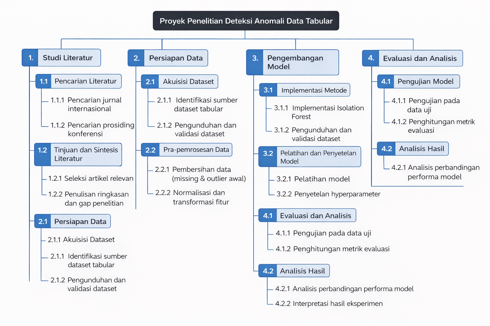

# Proposal Tugas Akhir

- **Nama:** Muhammad Irfan Maulana  
- **NIM:** 202310370311480  

---

## 1. Topik Penelitian

### 1.1 Topik Penelitian
**Penerapan Metode Pembelajaran Mesin Tidak Terawasi untuk Deteksi Anomali dalam Data Tabular**

### 1.2 Tujuan Umum (Aim)
Tujuan umum dari penelitian ini adalah mengembangkan dan mengevaluasi metode pembelajaran mesin tidak terawasi yang mampu mendeteksi anomali secara efektif pada data tabular sehingga dapat meningkatkan keandalan proses analisis data dan mendukung pengambilan keputusan yang lebih akurat.

### 1.3 Tujuan Khusus (Objectives)
- Mengumpulkan dan mempersiapkan dataset tabular yang relevan dalam waktu 3 minggu.
- Mengimplementasikan minimal tiga metode pembelajaran mesin tidak terawasi untuk deteksi anomali dalam waktu 4 minggu.
- Melakukan pelatihan dan penyetelan parameter model secara sistematis dalam waktu 2 minggu.
- Mengevaluasi kinerja setiap model menggunakan metrik evaluasi yang sesuai dalam waktu 2 minggu.
- Menyusun laporan akhir penelitian secara lengkap dan sistematis dalam waktu 3 minggu.

---

## 2. Perencanaan Pengerjaan Proyek

### 2.1 Work Breakdown Structure (WBS)

### 2.2 Estimasi Waktu Leaf Task

| ID  | Leaf Task                        | Effort (minggu) | Durasi (minggu) | Ketergantungan |
|-----|----------------------------------|----------------|----------------|---------------|
| T1  | Pencarian jurnal                 | 1              | 1              | -             |
| T2  | Seleksi artikel                  | 1              | 1              | T1            |
| T3  | Penulisan ringkasan literatur    | 2              | 2              | T2            |
| T4  | Pengumpulan dataset              | 1              | 1              | T3            |
| T5  | Preprocessing data               | 2              | 2              | T4            |
| T6  | Implementasi model               | 3              | 3              | T5            |
| T7  | Training & tuning model          | 2              | 2              | T6            |
| T8  | Pengujian model                  | 1              | 1              | T7            |
| T9  | Analisis hasil                   | 1              | 1              | T8            |
| T10 | Penulisan laporan                | 3              | 3              | T9            |

### 2.3 Critical Path
Critical path proyek ini adalah:  
**T1 → T2 → T3 → T4 → T5 → T6 → T7 → T8 → T9 → T10**  
Total durasi proyek adalah **17 minggu**. Seluruh aktivitas pada jalur ini tidak memiliki slack sehingga keterlambatan satu aktivitas akan langsung mempengaruhi penyelesaian proyek.

### 2.4 Milestone
- **M1:** Studi literatur selesai (minggu ke-4)
- **M2:** Data siap digunakan (minggu ke-7)
- **M3:** Model selesai dikembangkan (minggu ke-12)
- **M4:** Evaluasi dan analisis selesai (minggu ke-14)
- **M5:** Laporan akhir selesai (minggu ke-17)

### 2.5 Activity-on-Node (AON) Diagram

*AON*

```mermaid
graph LR
  %% Definisi Node dengan informasi Start & Durasi (minggu)
  T1["<b>T1: Pencarian Jurnal</b><br/>Start: Minggu 1<br/>Durasi: 1 minggu"]
  T2["<b>T2: Seleksi Artikel</b><br/>Start: Minggu 2<br/>Durasi: 1 minggu"]
  T3["<b>T3: Penulisan Ringkasan Literatur</b><br/>Start: Minggu 3<br/>Durasi: 2 minggu"]
  M1{{Milestone 1: Studi Literatur Selesai}}

  T4["<b>T4: Pengumpulan Dataset</b><br/>Start: Minggu 5<br/>Durasi: 1 minggu"]
  T5["<b>T5: Preprocessing Data</b><br/>Start: Minggu 6<br/>Durasi: 2 minggu"]
  M2{{Milestone 2: Data Siap Digunakan}}

  T6["<b>T6: Implementasi Model</b><br/>Start: Minggu 8<br/>Durasi: 3 minggu"]
  T7["<b>T7: Training & Tuning Model</b><br/>Start: Minggu 11<br/>Durasi: 2 minggu"]
  M3{{Milestone 3: Model Siap Diuji}}

  T8["<b>T8: Pengujian Model</b><br/>Start: Minggu 13<br/>Durasi: 1 minggu"]
  T9["<b>T9: Analisis Hasil</b><br/>Start: Minggu 14<br/>Durasi: 1 minggu"]
  M4{{Milestone 4: Evaluasi Selesai}}

  T10["<b>T10: Penulisan Laporan</b><br/>Start: Minggu 15<br/>Durasi: 3 minggu"]
  M5{{Milestone 5: Laporan Akhir Selesai}}

  %% Hubungan antar Task
  T1 --> T2
  T2 --> T3
  T3 --> M1
  M1 --> T4
  T4 --> T5
  T5 --> M2
  M2 --> T6
  T6 --> T7
  T7 --> M3
  M3 --> T8
  T8 --> T9
  T9 --> M4
  M4 --> T10
  T10 --> M5

```

---

## 3. Latar Belakang Penelitian

Deteksi anomali merupakan bidang studi penting dalam pembelajaran mesin yang berfokus pada identifikasi data yang tidak sesuai dengan pola normal yang diharapkan. Dalam era big data saat ini, anomali dapat muncul dalam berbagai domain aplikasi seperti keamanan siber, kesehatan, keuangan, dan proses industri. Menurut Dai, Hwang, dan Fan (2024), deteksi anomali memiliki implikasi yang luas dalam analisis data modern, termasuk deteksi penipuan, deteksi intrusi jaringan, diagnostik medis, dan deteksi ledakan otomatis. Data tabular merupakan bentuk data yang paling umum digunakan dalam berbagai bidang ilmiah dan industri, sehingga pengembangan metode deteksi anomali yang efektif pada data jenis ini menjadi sangat krusial[1]. Pendekatan pembelajaran mesin tidak terawasi (unsupervised) menjadi semakin relevan karena prevalensi data yang tidak berlabel dalam praktik nyata, di mana proses pelabelan data memerlukan biaya dan waktu yang signifikan[2].

Di Indonesia, pemanfaatan metode deteksi anomali pada data tabular masih belum optimal, padahal banyak sektor strategis seperti perbankan, telekomunikasi, dan kesehatan menghasilkan data tabular dalam jumlah besar setiap harinya. Tantangan utama dalam implementasi metode ini di Indonesia adalah terbatasnya ketersediaan data berlabel untuk melatih model supervised learning, serta kompleksitas struktur data yang beragam antar domain. Dataset tabular dunia nyata seringkali mengandung sampel anomali yang dapat mempengaruhi analisis hilir secara negatif[2]. Selain itu, metode-metode tradisional seperti pendekatan berbasis proximitas (KNN, LOF, CBLOF) seringkali rentan terhadap pemilihan ukuran jarak dan kurang optimal pada data berdimensi tinggi, di mana curse of dimensionality menyebabkan jarak menjadi kurang bermakna[2]. Oleh karena itu, diperlukan pengembangan dan evaluasi metode deteksi anomali tidak terawasi yang lebih robust dan dapat beradaptasi dengan karakteristik data lokal di Indonesia.

Beberapa penelitian terdahulu telah memberikan kontribusi signifikan dalam bidang deteksi anomali tidak terawasi. Bouman, Bukhsh, dan Heskes (2024) melakukan studi komparatif terbesar hingga saat ini dengan mengevaluasi 33 algoritma deteksi anomali tidak terawasi pada 52 dataset tabular dunia nyata. Hasil penelitian mereka menunjukkan bahwa algoritma Extended Isolation Forest (EIF) secara signifikan mengungguli algoritma lainnya, dengan algoritma k-Nearest Neighbor (kNN) berkinerja terbaik pada dataset dengan anomali lokal, sementara EIF unggul pada dataset dengan anomali global[1]. Selanjutnya, Zamberg, Salhov, Lindenbaum, dan Averbuch (2023) mengembangkan TabADM, sebuah model probabilistik berbasis diffusion yang efektif untuk deteksi anomali tidak terawasi pada data tabular. Model mereka menggunakan skema penolakan unik untuk melemahkan pengaruh anomali pada estimasi densitas dan menunjukkan kinerja yang relatif stabil terhadap dimensi data tanpa memerlukan penyetelan hyperparameter yang ekstensif[2]. Penelitian terbaru oleh Dai, Hwang, dan Fan (2024) memperkenalkan metode novel berbasis noise evaluation yang mencapai skor AUC rata-rata 92,27% pada lebih dari 60 dataset benchmark, menunjukkan keunggulan dibandingkan 12 metode baseline termasuk state-of-the-art[3].

Pada penelitian ini, metode yang akan digunakan untuk deteksi anomali pada data tabular adalah pendekatan pembelajaran mesin tidak terawasi yang mengkombinasikan beberapa algoritma utama. Berdasarkan temuan dari studi komparatif Bouman et al. (2024), penelitian ini akan mengimplementasikan algoritma Isolation Forest, Extended Isolation Forest (EIF), dan k-Nearest Neighbor (kNN) sebagai metode baseline[1]. Pemilihan algoritma ini didasarkan pada kemampuannya dalam menangani berbagai tipe anomali, baik lokal maupun global. Isolation Forest bekerja dengan prinsip isolasi di mana anomali lebih mudah diisolasi dibandingkan data normal karena berada di region dengan densitas rendah[1]. Sebagai kontribusi utama, penelitian ini akan melakukan evaluasi komprehensif terhadap performa algoritma-algoritma tersebut pada dataset tabular yang relevan dengan konteks Indonesia, serta mengeksplorasi kombinasi optimal dari metode-metode tersebut untuk meningkatkan akurasi deteksi.

Penelitian ini diharapkan dapat memberikan kontribusi praktis dan ilmiah yang signifikan dalam bidang deteksi anomali. Dari sisi praktis, hasil penelitian dapat diaplikasikan untuk meningkatkan keandalan proses analisis data dalam berbagai sektor industri di Indonesia, seperti deteksi transaksi mencurigakan dalam sistem perbankan, identifikasi pola abnormal dalam data kesehatan pasien, dan monitoring kondisi peralatan industri untuk predictive maintenance. Dari sisi ilmiah, penelitian ini akan memberikan pemahaman yang lebih mendalam mengenai karakteristik algoritma deteksi anomali tidak terawasi pada data tabular, serta memberikan rekomendasi praktis mengenai pemilihan algoritma yang sesuai berdasarkan karakteristik dataset. Menurut Bouman et al. (2024), dengan mempertimbangkan kompleksitas komputasional algoritma, sebuah toolbox dengan dua algoritma deteksi anomali tidak terawasi (EIF dan kNN) sudah cukup memadai untuk menemukan anomali dalam koleksi representatif dataset multivariat[1]. Dengan demikian, penelitian ini diharapkan dapat mendukung pengambilan keputusan yang lebih akurat dan efisien dalam berbagai domain aplikasi.

---

## 4. Daftar Pustaka
*Gunakan format sitasi konsisten (APA atau IEEE). Masukkan minimal lima referensi utama dan urutkan sesuai pedoman di Minggu-11. Contoh format:*

- *NamaBelakang, Inisial. (Tahun). Judul artikel. Nama Jurnal, Volume(Nomor), halaman. DOI/URL.*

---

## 5. Prompt AI yang Digunakan
*Salin seluruh prompt dan ringkas respons AI yang relevan dengan penyusunan proposal. Gunakan format bernomor (Prompt 1, Prompt 2, dst.) seperti panduan dokumentasi AI pada README. Jika ada percakapan yang tidak dipakai, cantumkan tetap sebagai bukti penggunaan AI.*

---

> Checklist akhir:
> - [ ] Semua instruksi telah diganti dengan konten final.
> - [ ] Referensi berasal dari sumber akademik kredibel dan terdaftar di bagian ini.
> - [ ] Daftar prompt dan respons AI sudah didokumentasikan lengkap.
> - [ ] Seluruh bagian mematuhi ketentuan penggunaan AI hanya sebagai teman diskusi.