# Proposal Tugas Akhir

- **Nama:** Muhammad Irfan Maulana  
- **NIM:** 202310370311480  

---

## 1. Topik Penelitian

### 1.1 Topik Penelitian
**Penerapan Metode Machine Learning Tidak Terawasi untuk Deteksi Anomali dalam Data Tabular**

### 1.2 Tujuan Umum (Aim)
Mengembangkan dan mengevaluasi metode machine learning tidak terawasi (unsupervised) untuk mendeteksi anomali pada data tabular multivariat.

### 1.3 Tujuan Khusus (Objectives)
- **O1:** Menyelesaikan studi literatur dan tinjauan pustaka mengenai teknik deteksi anomali tidak terawasi pada data tabular, mencakup minimal 15 artikel jurnal internasional dalam waktu 4 minggu.
- **O2:** Mengumpulkan dan menyiapkan minimal 10 dataset tabular benchmark dari repository ADBench dan ODDS untuk eksperimen dalam waktu 3 minggu.
- **O3:** Mengimplementasikan minimal tiga algoritma deteksi anomali (Extended Isolation Forest, k-Nearest Neighbor, dan Isolation Forest) menggunakan Python dengan library PyOD dalam waktu 3 minggu.
- **O4:** Melakukan training dan hyperparameter tuning pada setiap algoritma menggunakan metode validasi yang sesuai dalam waktu 2 minggu.
- **O5:** Mengevaluasi dan membandingkan kinerja model menggunakan metrik ROC-AUC dan Average Precision (AP) dengan target rata-rata AUC minimal 85% dalam waktu 2 minggu.
- **O6:** Menyusun laporan akhir penelitian yang komprehensif mencakup analisis hasil dan rekomendasi pemilihan algoritma dalam waktu 3 minggu.

---

## 2. Perencanaan Pengerjaan Proyek

### 2.1 Work Breakdown Structure (WBS)

### 2.2 Estimasi Waktu Leaf Task

*Estimasi waktu mengikuti metode perhitungan effort dan durasi sesuai pedoman Minggu-11, slide 14. Effort menunjukkan jumlah waktu kerja aktual yang dibutuhkan, sedangkan durasi menunjukkan rentang waktu kalender hingga tugas selesai.*

| ID   | Leaf Task (Activity)                                          | Effort (minggu) | Durasi (minggu) | Ketergantungan |
|------|---------------------------------------------------------------|-----------------|-----------------|----------------|
| T1   | Pencarian jurnal deteksi anomali di database akademik         | 1               | 1               | -              |
| T2   | Seleksi dan review artikel relevan (min. 20 artikel)          | 1               | 1               | T1             |
| T3   | Penulisan ringkasan literatur dan identifikasi gap penelitian | 2               | 2               | T2             |
| T4   | Pengumpulan dataset tabular dari ADBench dan ODDS repository  | 1               | 1               | T3             |
| T5   | Preprocessing data (normalisasi, scaling, handling missing)   | 2               | 2               | T4             |
| T6   | Implementasi algoritma EIF, kNN, dan Isolation Forest         | 3               | 3               | T5             |
| T7   | Training dan hyperparameter tuning dengan grid search         | 2               | 2               | T6             |
| T8   | Pengujian model dan perhitungan metrik ROC-AUC dan AP         | 1               | 1               | T7             |
| T9   | Analisis perbandingan performa dan interpretasi hasil         | 1               | 1               | T8             |
| T10  | Penulisan bab pendahuluan dan metodologi                      | 1.5             | 1.5             | T9             |
| T11  | Penulisan bab hasil, pembahasan, dan kesimpulan               | 1.5             | 1.5             | T10            |

**Total Effort:** 17 minggu  
**Total Durasi:** 17 minggu

### 2.3 Critical Path

*Penentuan critical path mengikuti langkah-langkah pada Minggu-11, slide 18-25: (1) menentukan tanggal mulai paling awal untuk setiap aktivitas, (2) bekerja mundur dari akhir ke awal, (3) mengidentifikasi tugas-tugas yang tidak boleh tertunda.*

**Critical Path:** T1 → T2 → T3 → T4 → T5 → T6 → T7 → T8 → T9 → T10 → T11  

**Total Durasi Critical Path:** 17 minggu

**Justifikasi:**  
Seluruh aktivitas dalam proyek ini bersifat sekuensial dengan ketergantungan linear, sehingga setiap tugas harus diselesaikan sebelum tugas berikutnya dapat dimulai. Berdasarkan analisis jaringan aktivitas (Activity-on-Node), tidak terdapat aktivitas yang dapat dilakukan secara paralel karena setiap tugas memiliki satu predecessor. Hal ini berarti seluruh aktivitas berada pada jalur kritis dengan slack = 0. Konsekuensinya, keterlambatan pada satu aktivitas akan langsung berdampak pada waktu penyelesaian proyek secara keseluruhan. Referensi dari Bouman et al. (2024) menunjukkan bahwa evaluasi algoritma deteksi anomali memerlukan urutan kerja yang sistematis mulai dari persiapan data hingga evaluasi metrik[1].

### 2.4 Milestone

*Milestone merupakan langkah-langkah penting menuju penyelesaian proyek (Minggu-11, slide 16, 24, 25). Setiap milestone menandai pencapaian objektif tertentu.*

- **M1: Studi Literatur Selesai** — Minggu ke-4  
  *Deliverable:* Dokumen tinjauan pustaka mencakup minimal 20 artikel tentang teknik deteksi anomali (EIF, kNN, Isolation Forest, diffusion models) dan identifikasi gap penelitian.

- **M2: Data Siap Digunakan** — Minggu ke-7  
  *Deliverable:* Minimal 10 dataset tabular benchmark dari repository ADBench dan ODDS yang sudah melalui preprocessing (normalisasi, scaling, pembersihan data).

- **M3: Model Selesai Dikembangkan** — Minggu ke-12  
  *Deliverable:* Implementasi tiga algoritma (EIF, kNN, Isolation Forest) menggunakan PyOD dengan hyperparameter yang sudah di-tuning.

- **M4: Evaluasi dan Analisis Selesai** — Minggu ke-14  
  *Deliverable:* Hasil evaluasi lengkap dengan metrik ROC-AUC dan Average Precision untuk setiap algoritma pada seluruh dataset, serta analisis perbandingan performa.

- **M5: Laporan Akhir Selesai** — Minggu ke-17  
  *Deliverable:* Dokumen laporan penelitian final yang mencakup pendahuluan, metodologi, hasil, pembahasan, dan kesimpulan.

### 2.5 Activity-on-Node (AON) Diagram

*Diagram Activity-on-Node (AON) dibuat mengikuti pedoman Minggu-11, slide 26-37. Node persegi panjang merepresentasikan tugas, node wajik merepresentasikan milestone, dan panah menunjukkan urutan pelaksanaan tugas. Jalur kritis ditandai dengan warna merah.*

```mermaid
graph LR
  subgraph Phase1[Fase 1: Studi Literatur]
    T1["<b>T1: Pencarian Jurnal</b><br/>Minggu 1<br/>Durasi: 1 minggu"]
    T2["<b>T2: Seleksi Artikel</b><br/>Minggu 2<br/>Durasi: 1 minggu"]
    T3["<b>T3: Penulisan Ringkasan</b><br/>Minggu 3-4<br/>Durasi: 2 minggu"]
  end
  M1{{M1: Studi Literatur Selesai}}

  subgraph Phase2[Fase 2: Persiapan Data]
    T4["<b>T4: Pengumpulan Dataset</b><br/>Minggu 5<br/>Durasi: 1 minggu"]
    T5["<b>T5: Preprocessing Data</b><br/>Minggu 6-7<br/>Durasi: 2 minggu"]
  end
  M2{{M2: Data Siap Digunakan}}

  subgraph Phase3[Fase 3: Pengembangan Model]
    T6["<b>T6: Implementasi EIF, kNN, IF</b><br/>Minggu 8-10<br/>Durasi: 3 minggu"]
    T7["<b>T7: Training & Tuning</b><br/>Minggu 11-12<br/>Durasi: 2 minggu"]
  end
  M3{{M3: Model Siap Diuji}}

  subgraph Phase4[Fase 4: Evaluasi]
    T8["<b>T8: Pengujian Model</b><br/>Minggu 13<br/>Durasi: 1 minggu"]
    T9["<b>T9: Analisis Hasil</b><br/>Minggu 14<br/>Durasi: 1 minggu"]
  end
  M4{{M4: Evaluasi Selesai}}

  subgraph Phase5[Fase 5: Penyusunan Laporan]
    T10["<b>T10: Penulisan Pendahuluan & Metodologi</b><br/>Minggu 14.5-16<br/>Durasi: 1.5 minggu"]
    T11["<b>T11: Penulisan Hasil & Kesimpulan</b><br/>Minggu 16-17<br/>Durasi: 1.5 minggu"]
  end
  M5{{M5: Laporan Akhir Selesai}}

  T1 --> T2
  T2 --> T3
  T3 --> M1
  M1 --> T4
  T4 --> T5
  T5 --> M2
  M2 --> T6
  T6 --> T7
  T7 --> M3
  M3 --> T8
  T8 --> T9
  T9 --> M4
  M4 --> T10
  T10 --> T11
  T11 --> M5

  style T1 fill:#ff6b6b,stroke:#333,color:#fff
  style T2 fill:#ff6b6b,stroke:#333,color:#fff
  style T3 fill:#ff6b6b,stroke:#333,color:#fff
  style T4 fill:#ff6b6b,stroke:#333,color:#fff
  style T5 fill:#ff6b6b,stroke:#333,color:#fff
  style T6 fill:#ff6b6b,stroke:#333,color:#fff
  style T7 fill:#ff6b6b,stroke:#333,color:#fff
  style T8 fill:#ff6b6b,stroke:#333,color:#fff
  style T9 fill:#ff6b6b,stroke:#333,color:#fff
  style T10 fill:#ff6b6b,stroke:#333,color:#fff
  style T11 fill:#ff6b6b,stroke:#333,color:#fff
```

*Catatan: Semua node berwarna merah menunjukkan bahwa seluruh aktivitas berada pada jalur kritis (critical path) dengan slack = 0.*

---

## 3. Latar Belakang Penelitian

Deteksi anomali (*anomaly detection*) merupakan proses identifikasi data yang menyimpang dari pola normal dalam suatu dataset. Menurut Grubbs (1969), anomali didefinisikan sebagai observasi yang tampak menyimpang secara signifikan dari anggota sampel lainnya[5]. Dalam era digital saat ini, deteksi anomali menjadi semakin penting karena memiliki aplikasi yang luas di berbagai domain, termasuk deteksi intrusi jaringan (*network intrusion detection*), deteksi penipuan (*fraud detection*), analisis data medis, serta *predictive maintenance* pada sektor industri[3][5]. Goldstein dan Uchida (2016) dalam studi komparatif mereka menekankan bahwa teknik deteksi anomali kini digunakan untuk mendeteksi aktivitas mencurigakan yang mungkin mengindikasikan ancaman keamanan atau kejadian tidak normal lainnya[5]. Data tabular merupakan bentuk data yang paling umum digunakan dalam berbagai bidang ilmiah dan industri, sehingga pengembangan metode deteksi anomali yang efektif pada jenis data ini menjadi sangat krusial[3].

Di Indonesia, pemanfaatan metode deteksi anomali pada data tabular belum optimal meskipun banyak sektor strategis seperti perbankan, telekomunikasi, dan kesehatan menghasilkan data dalam jumlah besar setiap harinya. Prabuningrat, Hostiadi, dan Srinadi (2024) menjelaskan bahwa seiring perkembangan teknologi internet, keamanan siber menjadi perhatian mendesak karena potensi serangan oleh pihak tidak bertanggung jawab dapat menyebabkan kerugian finansial yang signifikan[4]. Tantangan utama dalam implementasi metode ini adalah terbatasnya ketersediaan data berlabel untuk melatih model *supervised learning*, serta metode berbasis signature yang memerlukan pembaruan database secara terus-menerus[4]. Metode tradisional seperti pendekatan berbasis *proximitas* (kNN, LOF, CBLOF) juga rentan terhadap pemilihan *distance measure* dan kurang optimal pada data berdimensi tinggi karena *curse of dimensionality*[2]. Oleh karena itu, diperlukan pendekatan *unsupervised* yang lebih robust dan dapat mendeteksi anomali tanpa memerlukan data berlabel.

Beberapa penelitian terdahulu telah memberikan kontribusi signifikan dalam bidang deteksi anomali tidak terawasi. Bouman, Bukhsh, dan Heskes (2024) melakukan studi komparatif terbesar hingga saat ini dengan mengevaluasi 33 algoritma deteksi anomali pada 52 dataset tabular dunia nyata dan menemukan bahwa Extended Isolation Forest (EIF) secara signifikan mengungguli algoritma lainnya untuk anomali global, sementara kNN berkinerja terbaik untuk anomali lokal[1]. Goldstein dan Uchida (2016) mengevaluasi 19 algoritma pada 10 dataset berbeda dan merekomendasikan penggunaan kNN untuk anomali global, LOF untuk anomali lokal, dan HBOS untuk kecepatan pemrosesan[5]. Zamberg et al. (2023) mengembangkan TabADM berbasis *diffusion models* yang stabil terhadap dimensi data dan tidak memerlukan *hyperparameter tuning* ekstensif[2]. Dai, Hwang, dan Fan (2024) memperkenalkan metode *noise evaluation* yang mencapai AUC rata-rata 92,27% pada 60+ dataset benchmark[3]. Penelitian terbaru oleh Ye et al. (2025) mengusulkan Disent-AD yang memanfaatkan konsep *disentanglement* untuk menangkap korelasi intrinsik dalam data normal, mencapai peningkatan 6,1% pada AUC-PR dibandingkan metode state-of-the-art[6].

Penelitian ini akan mengimplementasikan pendekatan machine learning tidak terawasi dengan mengkombinasikan beberapa algoritma utama berdasarkan temuan dari studi-studi sebelumnya. Berdasarkan rekomendasi Bouman et al. (2024), penelitian ini akan mengimplementasikan algoritma Isolation Forest, Extended Isolation Forest (EIF), dan k-Nearest Neighbor (kNN) sebagai metode baseline[1]. Pemilihan algoritma ini didasarkan pada kemampuannya dalam menangani berbagai tipe anomali, baik lokal maupun global. Sebagaimana dijelaskan oleh Prabuningrat et al. (2024), preprocessing data yang meliputi *data transformation*, *data cleansing*, *handling null value*, dan *normalization* sangat penting untuk menghasilkan performa klasifikasi yang optimal[4]. Penelitian ini akan menggunakan dataset dari repository ADBench dan ODDS yang mencakup berbagai domain aplikasi seperti *healthcare*, *finance*, dan *network security*[6], serta melakukan evaluasi menggunakan metrik ROC-AUC dan Average Precision (AP) yang merupakan standar dalam bidang ini[1][3].

Penelitian ini diharapkan memberikan kontribusi praktis dan ilmiah yang signifikan. Dari sisi praktis, hasil penelitian dapat diaplikasikan untuk meningkatkan keamanan siber melalui deteksi aktivitas anomali dalam jaringan, deteksi transaksi mencurigakan dalam sistem perbankan, serta identifikasi pola abnormal dalam data kesehatan pasien. Menurut Goldstein dan Uchida (2016), selain performa deteksi, pertimbangan komputasi juga penting—HBOS dapat memproses dataset dalam waktu kurang dari satu menit sedangkan algoritma berbasis *nearest-neighbor* memerlukan waktu lebih dari 23 jam untuk dataset besar[5]. Dari sisi ilmiah, penelitian ini akan memberikan pemahaman mendalam mengenai karakteristik algoritma deteksi anomali pada data tabular Indonesia serta rekomendasi pemilihan algoritma berdasarkan tipe anomali (lokal vs global) dan karakteristik dataset. Dengan demikian, penelitian ini diharapkan dapat mendukung pengambilan keputusan yang lebih akurat dan efisien dalam berbagai domain aplikasi.

---

## 4. Daftar Pustaka

[1] L. Bouman, W. Bukhsh, dan T. Heskes, "Unsupervised Anomaly Detection Algorithms on Real-world Data: How Many Do We Need?," *arXiv preprint*, arXiv:2305.00735, 2024. [Online]. Available: https://arxiv.org/abs/2305.00735

[2] J. Zamberg, I. Salhov, O. Lindenbaum, dan A. Averbuch, "TabADM: Unsupervised Tabular Anomaly Detection with Diffusion Models," *arXiv preprint*, arXiv:2307.12336, 2023. [Online]. Available: https://arxiv.org/abs/2307.12336

[3] Z. Dai, T. Hwang, dan W. Fan, "Unsupervised Anomaly Detection for Tabular Data Using Noise Evaluation," *arXiv preprint*, arXiv:2412.11461, 2024. [Online]. Available: https://arxiv.org/abs/2412.11461

[4] G. S. W. Prabuningrat, D. P. Hostiadi, dan N. L. P. Srinadi, "Klasifikasi Deteksi Anomali Menggunakan Metode Machine Learning," *Prosiding Seminar Hasil Penelitian Informatika dan Komputer (SPINTER)*, vol. 1, no. 2, pp. 845-850, 2024. E-ISSN: 3031-9692.

[5] M. Goldstein dan S. Uchida, "A Comparative Evaluation of Unsupervised Anomaly Detection Algorithms for Multivariate Data," *PLoS ONE*, vol. 11, no. 4, e0152173, 2016. doi: 10.1371/journal.pone.0152173

[6] J. Ye, Z. Tan, Y. Hu, X. Yang, G. Cheng, dan K. Huang, "Disentangling Tabular Data Towards Better One-Class Anomaly Detection," *Proceedings of the Thirty-Ninth AAAI Conference on Artificial Intelligence (AAAI-25)*, pp. 13061-13068, 2025. [Online]. Available: https://arxiv.org/abs/2411.07574

---

## 5. Prompt AI yang Digunakan
*Salin seluruh prompt dan ringkas respons AI yang relevan dengan penyusunan proposal. Gunakan format bernomor (Prompt 1, Prompt 2, dst.) seperti panduan dokumentasi AI pada README. Jika ada percakapan yang tidak dipakai, cantumkan tetap sebagai bukti penggunaan AI.*

---

> Checklist akhir:
> - [ ] Semua instruksi telah diganti dengan konten final.
> - [ ] Referensi berasal dari sumber akademik kredibel dan terdaftar di bagian ini.
> - [ ] Daftar prompt dan respons AI sudah didokumentasikan lengkap.
> - [ ] Seluruh bagian mematuhi ketentuan penggunaan AI hanya sebagai teman diskusi.