# Proposal Tugas Akhir

- **Nama:** Muhammad Irfan Maulana  
- **NIM:** 202310370311480  

---

## 1. Topik Penelitian

### 1.1 Topik Penelitian
**Penerapan Metode Machine Learning Tidak Terawasi untuk Deteksi Anomali dalam Data Tabular**

### 1.2 Tujuan Umum (Aim)
Mengembangkan dan mengevaluasi metode machine learning tidak terawasi (unsupervised) untuk mendeteksi anomali pada data tabular multivariat.

### 1.3 Tujuan Khusus (Objectives)
- **O1:** Menyelesaikan studi literatur dan tinjauan pustaka mengenai teknik deteksi anomali tidak terawasi pada data tabular, mencakup minimal 15 artikel jurnal internasional dalam waktu 4 minggu.
- **O2:** Mengumpulkan dan menyiapkan minimal 10 dataset tabular benchmark dari repository ADBench dan ODDS untuk eksperimen dalam waktu 3 minggu.
- **O3:** Mengimplementasikan minimal tiga algoritma deteksi anomali (Extended Isolation Forest, k-Nearest Neighbor, dan Isolation Forest) menggunakan Python dengan library PyOD dalam waktu 3 minggu.
- **O4:** Melakukan training dan hyperparameter tuning pada setiap algoritma menggunakan metode validasi yang sesuai dalam waktu 2 minggu.
- **O5:** Mengevaluasi dan membandingkan kinerja model menggunakan metrik ROC-AUC dan Average Precision (AP) dengan target rata-rata AUC minimal 85% dalam waktu 2 minggu.
- **O6:** Menyusun laporan akhir penelitian yang komprehensif mencakup analisis hasil dan rekomendasi pemilihan algoritma dalam waktu 3 minggu.

---

## 2. Perencanaan Pengerjaan Proyek

### 2.1 Work Breakdown Structure (WBS)

### 2.2 Estimasi Waktu Leaf Task

*Estimasi waktu mengikuti metode perhitungan effort dan durasi sesuai pedoman Minggu-11, slide 14. Effort menunjukkan jumlah waktu kerja aktual yang dibutuhkan, sedangkan durasi menunjukkan rentang waktu kalender hingga tugas selesai.*

| ID   | Leaf Task (Activity)                                          | Effort (minggu) | Durasi (minggu) | Ketergantungan |
|------|---------------------------------------------------------------|-----------------|-----------------|----------------|
| T1   | Pencarian jurnal deteksi anomali di database akademik         | 1               | 1               | -              |
| T2   | Seleksi dan review artikel relevan (min. 20 artikel)          | 1               | 1               | T1             |
| T3   | Penulisan ringkasan literatur dan identifikasi gap penelitian | 2               | 2               | T2             |
| T4   | Pengumpulan dataset tabular dari ADBench dan ODDS repository  | 1               | 1               | T3             |
| T5   | Preprocessing data (normalisasi, scaling, handling missing)   | 2               | 2               | T4             |
| T6   | Implementasi algoritma EIF, kNN, dan Isolation Forest         | 3               | 3               | T5             |
| T7   | Training dan hyperparameter tuning dengan grid search         | 2               | 2               | T6             |
| T8   | Pengujian model dan perhitungan metrik ROC-AUC dan AP         | 1               | 1               | T7             |
| T9   | Analisis perbandingan performa dan interpretasi hasil         | 1               | 1               | T8             |
| T10  | Penulisan bab pendahuluan dan metodologi                      | 1.5             | 1.5             | T9             |
| T11  | Penulisan bab hasil, pembahasan, dan kesimpulan               | 1.5             | 1.5             | T10            |

**Total Effort:** 17 minggu  
**Total Durasi:** 17 minggu

### 2.3 Critical Path

*Penentuan critical path mengikuti langkah-langkah pada Minggu-11, slide 18-25: (1) menentukan tanggal mulai paling awal untuk setiap aktivitas, (2) bekerja mundur dari akhir ke awal, (3) mengidentifikasi tugas-tugas yang tidak boleh tertunda.*

**Critical Path:** T1 → T2 → T3 → T4 → T5 → T6 → T7 → T8 → T9 → T10 → T11  

**Total Durasi Critical Path:** 17 minggu

**Justifikasi:**  
Seluruh aktivitas dalam proyek ini bersifat sekuensial dengan ketergantungan linear, sehingga setiap tugas harus diselesaikan sebelum tugas berikutnya dapat dimulai. Berdasarkan analisis jaringan aktivitas (Activity-on-Node), tidak terdapat aktivitas yang dapat dilakukan secara paralel karena setiap tugas memiliki satu predecessor. Hal ini berarti seluruh aktivitas berada pada jalur kritis dengan slack = 0. Konsekuensinya, keterlambatan pada satu aktivitas akan langsung berdampak pada waktu penyelesaian proyek secara keseluruhan. Referensi dari Bouman et al. (2024) menunjukkan bahwa evaluasi algoritma deteksi anomali memerlukan urutan kerja yang sistematis mulai dari persiapan data hingga evaluasi metrik[1].

### 2.4 Milestone

*Milestone merupakan langkah-langkah penting menuju penyelesaian proyek (Minggu-11, slide 16, 24, 25). Setiap milestone menandai pencapaian objektif tertentu.*

- **M1: Studi Literatur Selesai** — Minggu ke-4  
  *Deliverable:* Dokumen tinjauan pustaka mencakup minimal 20 artikel tentang teknik deteksi anomali (EIF, kNN, Isolation Forest, diffusion models) dan identifikasi gap penelitian.

- **M2: Data Siap Digunakan** — Minggu ke-7  
  *Deliverable:* Minimal 10 dataset tabular benchmark dari repository ADBench dan ODDS yang sudah melalui preprocessing (normalisasi, scaling, pembersihan data).

- **M3: Model Selesai Dikembangkan** — Minggu ke-12  
  *Deliverable:* Implementasi tiga algoritma (EIF, kNN, Isolation Forest) menggunakan PyOD dengan hyperparameter yang sudah di-tuning.

- **M4: Evaluasi dan Analisis Selesai** — Minggu ke-14  
  *Deliverable:* Hasil evaluasi lengkap dengan metrik ROC-AUC dan Average Precision untuk setiap algoritma pada seluruh dataset, serta analisis perbandingan performa.

- **M5: Laporan Akhir Selesai** — Minggu ke-17  
  *Deliverable:* Dokumen laporan penelitian final yang mencakup pendahuluan, metodologi, hasil, pembahasan, dan kesimpulan.

### 2.5 Activity-on-Node (AON) Diagram

*Diagram Activity-on-Node (AON) dibuat mengikuti pedoman Minggu-11, slide 26-37. Node persegi panjang merepresentasikan tugas, node wajik merepresentasikan milestone, dan panah menunjukkan urutan pelaksanaan tugas. Jalur kritis ditandai dengan warna merah.*

```mermaid
graph LR
  subgraph Phase1[Fase 1: Studi Literatur]
    T1["<b>T1: Pencarian Jurnal</b><br/>Minggu 1<br/>Durasi: 1 minggu"]
    T2["<b>T2: Seleksi Artikel</b><br/>Minggu 2<br/>Durasi: 1 minggu"]
    T3["<b>T3: Penulisan Ringkasan</b><br/>Minggu 3-4<br/>Durasi: 2 minggu"]
  end
  M1{{M1: Studi Literatur Selesai}}

  subgraph Phase2[Fase 2: Persiapan Data]
    T4["<b>T4: Pengumpulan Dataset</b><br/>Minggu 5<br/>Durasi: 1 minggu"]
    T5["<b>T5: Preprocessing Data</b><br/>Minggu 6-7<br/>Durasi: 2 minggu"]
  end
  M2{{M2: Data Siap Digunakan}}

  subgraph Phase3[Fase 3: Pengembangan Model]
    T6["<b>T6: Implementasi EIF, kNN, IF</b><br/>Minggu 8-10<br/>Durasi: 3 minggu"]
    T7["<b>T7: Training & Tuning</b><br/>Minggu 11-12<br/>Durasi: 2 minggu"]
  end
  M3{{M3: Model Siap Diuji}}

  subgraph Phase4[Fase 4: Evaluasi]
    T8["<b>T8: Pengujian Model</b><br/>Minggu 13<br/>Durasi: 1 minggu"]
    T9["<b>T9: Analisis Hasil</b><br/>Minggu 14<br/>Durasi: 1 minggu"]
  end
  M4{{M4: Evaluasi Selesai}}

  subgraph Phase5[Fase 5: Penyusunan Laporan]
    T10["<b>T10: Penulisan Pendahuluan & Metodologi</b><br/>Minggu 14.5-16<br/>Durasi: 1.5 minggu"]
    T11["<b>T11: Penulisan Hasil & Kesimpulan</b><br/>Minggu 16-17<br/>Durasi: 1.5 minggu"]
  end
  M5{{M5: Laporan Akhir Selesai}}

  T1 --> T2
  T2 --> T3
  T3 --> M1
  M1 --> T4
  T4 --> T5
  T5 --> M2
  M2 --> T6
  T6 --> T7
  T7 --> M3
  M3 --> T8
  T8 --> T9
  T9 --> M4
  M4 --> T10
  T10 --> T11
  T11 --> M5

  style T1 fill:#ff6b6b,stroke:#333,color:#fff
  style T2 fill:#ff6b6b,stroke:#333,color:#fff
  style T3 fill:#ff6b6b,stroke:#333,color:#fff
  style T4 fill:#ff6b6b,stroke:#333,color:#fff
  style T5 fill:#ff6b6b,stroke:#333,color:#fff
  style T6 fill:#ff6b6b,stroke:#333,color:#fff
  style T7 fill:#ff6b6b,stroke:#333,color:#fff
  style T8 fill:#ff6b6b,stroke:#333,color:#fff
  style T9 fill:#ff6b6b,stroke:#333,color:#fff
  style T10 fill:#ff6b6b,stroke:#333,color:#fff
  style T11 fill:#ff6b6b,stroke:#333,color:#fff
```

*Catatan: Semua node berwarna merah menunjukkan bahwa seluruh aktivitas berada pada jalur kritis (critical path) dengan slack = 0.*

---

## 3. Latar Belakang Penelitian

Dalam dunia yang semakin terdigitalisasi, kita sering dihadapkan pada tantangan untuk membedakan mana data yang "normal" dan mana yang menyimpang atau tidak biasa. Proses inilah yang kita kenal sebagai deteksi anomali. Kalau kita merujuk pada definisi klasik dari Grubbs yang dikemukakan sejak tahun 1969, anomali pada dasarnya adalah observasi yang terlihat sangat berbeda dibandingkan dengan anggota sampel lainnya dalam satu kelompok data[5]. Menariknya, seiring berjalannya waktu, aplikasi deteksi anomali ini berkembang sangat pesat dan menyentuh berbagai aspek kehidupan kita sehari-hari. Mulai dari mendeteksi aktivitas mencurigakan di jaringan komputer kita, mengidentifikasi transaksi kartu kredit yang tidak wajar, hingga membantu dokter menemukan pola-pola abnormal dalam data kesehatan pasien. Goldstein dan Uchida dalam studi komprehensif mereka di tahun 2016 menegaskan bahwa teknik-teknik deteksi anomali kini menjadi komponen penting dalam sistem keamanan modern untuk mengidentifikasi ancaman-ancaman potensial yang mungkin tidak terdeteksi dengan metode konvensional[5]. Yang menjadikan tantangan ini semakin menarik adalah kenyataan bahwa data tabular, yaitu data yang tersusun dalam format baris dan kolom seperti spreadsheet, merupakan bentuk data yang paling banyak kita jumpai di berbagai sektor industri dan penelitian ilmiah[3]. Oleh karena itu, mengembangkan metode deteksi anomali yang handal untuk jenis data ini bukan lagi sekadar pilihan, melainkan sudah menjadi kebutuhan yang mendesak.

Berbicara tentang kondisi di Indonesia, sebenarnya ada peluang besar yang belum tergarap secara maksimal. Sektor-sektor strategis seperti perbankan, telekomunikasi, dan kesehatan setiap harinya menghasilkan volume data tabular yang luar biasa besar, namun pemanfaatan teknik deteksi anomali masih terbilang terbatas. Prabuningrat, Hostiadi, dan Srinadi dalam penelitian mereka di tahun 2024 menggarisbawahi bahwa seiring dengan pesatnya pertumbuhan teknologi internet di Indonesia, ancaman keamanan siber juga ikut meningkat secara signifikan, dan serangan-serangan ini berpotensi menyebabkan kerugian finansial yang tidak sedikit[4]. Salah satu kendala utama yang dihadapi praktisi dan peneliti di Indonesia adalah sulitnya mendapatkan data yang sudah diberi label untuk keperluan pelatihan model supervised learning. Selain itu, pendekatan tradisional yang mengandalkan metode berbasis signature memiliki keterbatasan karena harus terus-menerus diperbarui setiap kali muncul pola serangan baru[4]. Di sisi lain, metode-metode klasik seperti k-Nearest Neighbor, Local Outlier Factor, dan Cluster-Based Local Outlier Factor juga punya kelemahan tersendiri, terutama dalam hal sensitivitas terhadap pemilihan parameter jarak dan performa yang menurun drastis ketika berhadapan dengan data berdimensi tinggi, sebuah fenomena yang dikenal sebagai curse of dimensionality[2]. Kondisi-kondisi inilah yang mendorong kebutuhan akan pendekatan unsupervised yang lebih robust dan tidak bergantung pada ketersediaan data berlabel.

Untungnya, komunitas peneliti di seluruh dunia tidak tinggal diam. Berbagai studi telah dilakukan untuk menjawab tantangan-tantangan di atas dan hasilnya cukup menjanjikan. Bouman, Bukhsh, dan Heskes baru-baru ini di tahun 2024 melakukan apa yang bisa dibilang sebagai studi komparatif paling komprehensif hingga saat ini, di mana mereka mengevaluasi tidak kurang dari 33 algoritma deteksi anomali pada 52 dataset tabular yang berasal dari kasus-kasus dunia nyata. Temuan mereka cukup menarik: Extended Isolation Forest atau EIF ternyata secara konsisten mengungguli algoritma-algoritma lainnya, khususnya untuk mendeteksi anomali yang bersifat global, sementara k-Nearest Neighbor justru lebih unggul dalam menangkap anomali-anomali lokal[1]. Sebelumnya, Goldstein dan Uchida juga sudah melakukan evaluasi serupa terhadap 19 algoritma dan merekomendasikan kombinasi penggunaan kNN untuk anomali global, LOF untuk anomali lokal, dan HBOS ketika kecepatan pemrosesan menjadi prioritas utama[5]. Di jalur penelitian yang berbeda, Zamberg dan rekan-rekannya di tahun 2023 memperkenalkan TabADM, sebuah pendekatan inovatif yang memanfaatkan diffusion models dan menunjukkan kestabilan yang mengagumkan terhadap variasi dimensi data tanpa memerlukan penyetelan hyperparameter yang rumit[2]. Tidak mau kalah, Dai, Hwang, dan Fan di tahun 2024 mengusulkan metode berbasis noise evaluation yang berhasil mencapai rata-rata AUC sebesar 92,27% ketika diuji pada lebih dari 60 dataset benchmark[3]. Yang paling terkini, Ye dan tim penelitinya dalam publikasi mereka di AAAI 2025 memperkenalkan Disent-AD, sebuah paradigma baru yang memanfaatkan konsep disentanglement untuk menangkap korelasi intrinsik dalam data normal dan berhasil meningkatkan performa AUC-PR hingga 6,1% dibandingkan metode-metode terdahulu[6].

Berangkat dari temuan-temuan penelitian di atas, penelitian ini akan mengambil pendekatan machine learning tidak terawasi dengan mengkombinasikan beberapa algoritma yang sudah terbukti efektif. Mengikuti rekomendasi dari studi komparatif Bouman dan kolega, tiga algoritma utama yang akan diimplementasikan adalah Isolation Forest, Extended Isolation Forest, dan k-Nearest Neighbor[1]. Pemilihan ketiga algoritma ini didasarkan pada kemampuan komplementer mereka dalam menangani tipe-tipe anomali yang berbeda, baik yang bersifat lokal maupun global. Sebagaimana ditekankan oleh Prabuningrat dan rekan-rekannya, tahapan preprocessing data yang mencakup transformasi data, pembersihan data, penanganan nilai null, dan normalisasi merupakan langkah krusial yang sangat mempengaruhi kualitas hasil akhir[4]. Untuk keperluan eksperimen, penelitian ini akan memanfaatkan dataset-dataset dari repository ADBench dan ODDS yang mencakup beragam domain aplikasi mulai dari healthcare, finance, hingga network security[6]. Evaluasi performa akan dilakukan menggunakan metrik ROC-AUC dan Average Precision yang sudah menjadi standar de facto dalam bidang deteksi anomali[1][3].

Pada akhirnya, penelitian ini diharapkan dapat memberikan kontribusi yang bermakna baik dari sisi praktis maupun akademis. Dari perspektif praktis, hasil-hasil yang diperoleh dapat langsung diaplikasikan untuk memperkuat sistem keamanan siber melalui deteksi aktivitas-aktivitas mencurigakan dalam jaringan, mengidentifikasi transaksi-transaksi yang berpotensi fraudulent dalam sistem perbankan, serta membantu tenaga medis dalam mengenali pola-pola abnormal pada data pasien. Hal yang juga perlu diperhatikan adalah aspek efisiensi komputasi, karena sebagaimana dicatat oleh Goldstein dan Uchida, terdapat trade-off yang signifikan antara akurasi dan kecepatan di mana algoritma seperti HBOS mampu memproses dataset dalam hitungan menit sementara pendekatan berbasis nearest-neighbor bisa memakan waktu lebih dari 23 jam untuk dataset berukuran besar[5]. Dari sisi akademis, penelitian ini akan menyumbangkan pemahaman yang lebih mendalam tentang bagaimana algoritma-algoritma deteksi anomali berperilaku pada karakteristik data yang khas di Indonesia, serta memberikan panduan praktis dalam memilih algoritma yang tepat berdasarkan tipe anomali yang ingin dideteksi dan karakteristik dataset yang tersedia. Dengan demikian, diharapkan penelitian ini dapat menjadi referensi berharga bagi praktisi dan peneliti yang bekerja di bidang serupa.

---

## 4. Daftar Pustaka

[1] L. Bouman, W. Bukhsh, dan T. Heskes, "Unsupervised Anomaly Detection Algorithms on Real-world Data: How Many Do We Need?," *arXiv preprint*, arXiv:2305.00735, 2024. [Online]. Available: https://arxiv.org/abs/2305.00735

[2] J. Zamberg, I. Salhov, O. Lindenbaum, dan A. Averbuch, "TabADM: Unsupervised Tabular Anomaly Detection with Diffusion Models," *arXiv preprint*, arXiv:2307.12336, 2023. [Online]. Available: https://arxiv.org/abs/2307.12336

[3] Z. Dai, T. Hwang, dan W. Fan, "Unsupervised Anomaly Detection for Tabular Data Using Noise Evaluation," *arXiv preprint*, arXiv:2412.11461, 2024. [Online]. Available: https://arxiv.org/abs/2412.11461

[4] G. S. W. Prabuningrat, D. P. Hostiadi, dan N. L. P. Srinadi, "Klasifikasi Deteksi Anomali Menggunakan Metode Machine Learning," *Prosiding Seminar Hasil Penelitian Informatika dan Komputer (SPINTER)*, vol. 1, no. 2, pp. 845-850, 2024. https://spinter.stikom-bali.ac.id/index.php/spinter/article/view/245

[5] M. Goldstein dan S. Uchida, "A Comparative Evaluation of Unsupervised Anomaly Detection Algorithms for Multivariate Data," *PLoS ONE*, vol. 11, no. 4, e0152173, 2016. https://journals.plos.org/plosone/article?id=10.1371/journal.pone.0152173

[6] J. Ye, Z. Tan, Y. Hu, X. Yang, G. Cheng, dan K. Huang, "Disentangling Tabular Data Towards Better One-Class Anomaly Detection," *Proceedings of the Thirty-Ninth AAAI Conference on Artificial Intelligence (AAAI-25)*, pp. 13061-13068, 2025. [Online]. Available: https://arxiv.org/abs/2411.07574

---

## 5. Prompt AI yang Digunakan
*Salin seluruh prompt dan ringkas respons AI yang relevan dengan penyusunan proposal. Gunakan format bernomor (Prompt 1, Prompt 2, dst.) seperti panduan dokumentasi AI pada README. Jika ada percakapan yang tidak dipakai, cantumkan tetap sebagai bukti penggunaan AI.*

---

> Checklist akhir:
> - [ ] Semua instruksi telah diganti dengan konten final.
> - [ ] Referensi berasal dari sumber akademik kredibel dan terdaftar di bagian ini.
> - [ ] Daftar prompt dan respons AI sudah didokumentasikan lengkap.
> - [ ] Seluruh bagian mematuhi ketentuan penggunaan AI hanya sebagai teman diskusi.